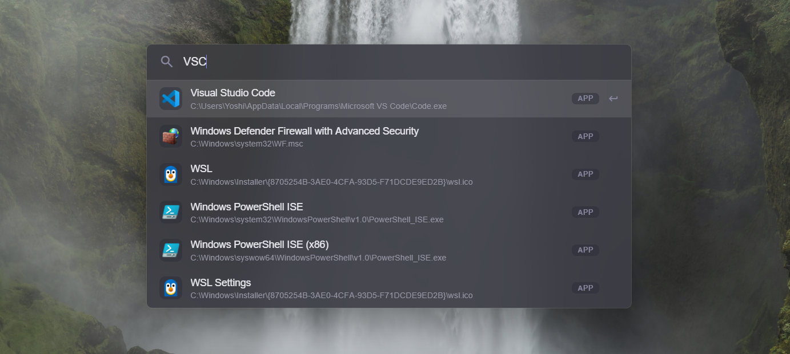
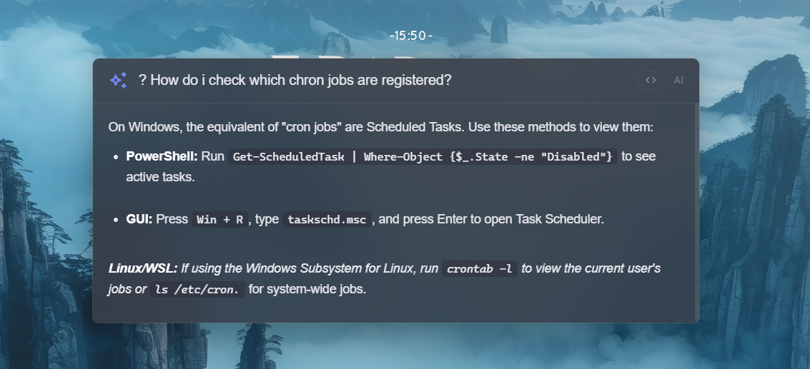
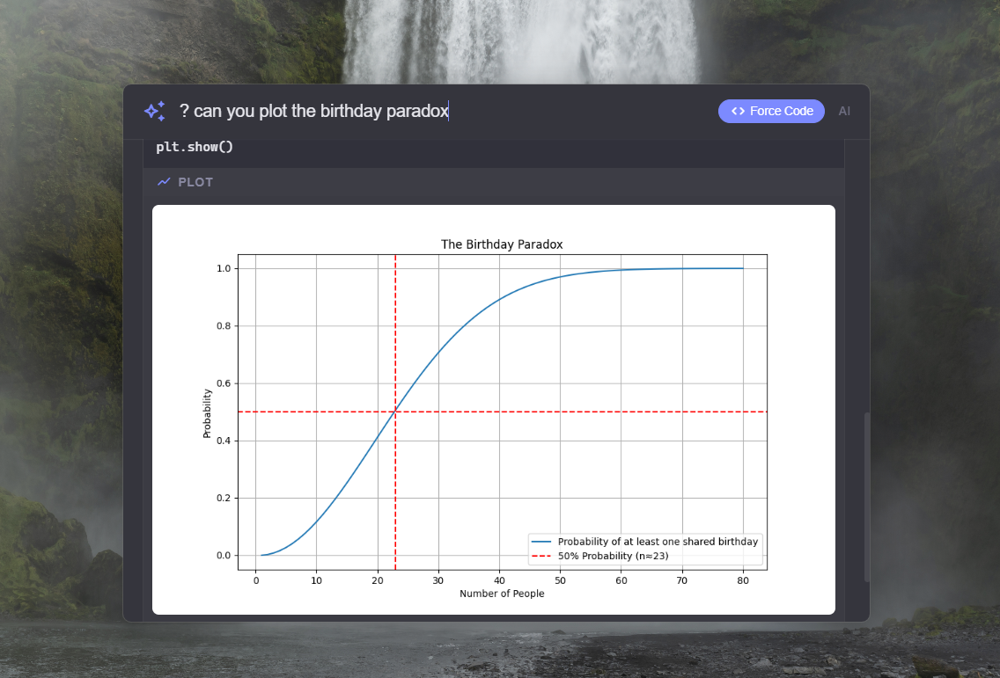
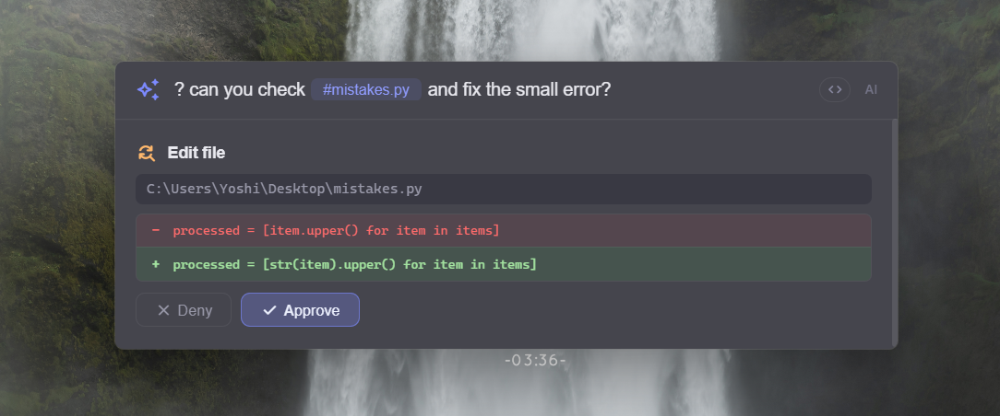
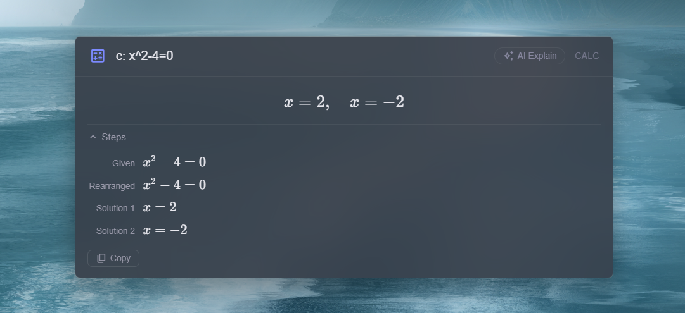
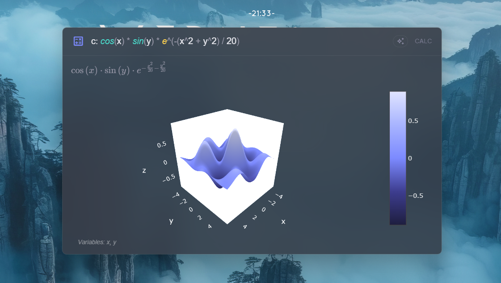
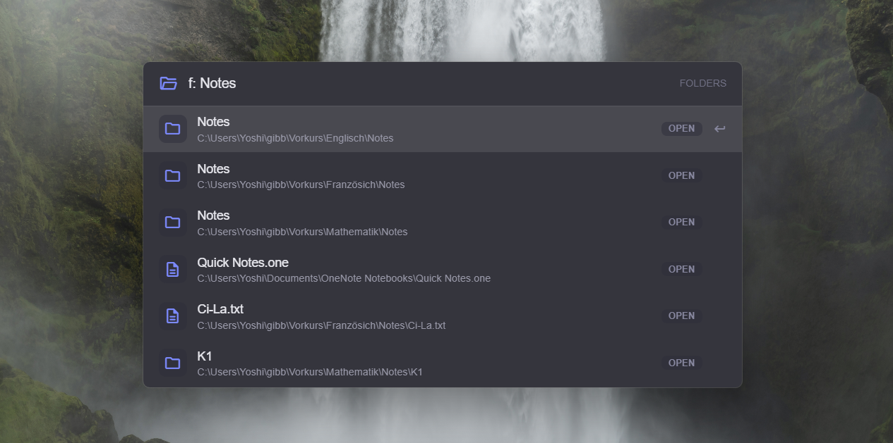

# TRIM

[](https://github.com/6A31/TRIM/releases/latest)
[](https://github.com/6A31/TRIM/releases/latest)
[](https://github.com/6A31/TRIM/releases/latest)

A launcher for Windows and macOS - kind of like Spotlight, but with AI baked in.

Hit **Alt+Space** (Option+Space on macOS) to toggle, type what you need, done. Remappable in `/settings`. Acrylic glass UI, stays out of your way.



## Features

### App Search

Just start typing to find your apps. Results are sorted by how often you use them, so the stuff you actually open ends up at the top. Fuzzy matching works too - `vsc` finds Visual Studio Code.

- **Windows**: Start Menu shortcuts + Microsoft Store / UWP apps
- **macOS**: `.app` bundles from `/Applications`, `/System/Applications`, and `~/Applications`

### AI Chat

Prefix your query with `?` for Gemini Flash or `??` for Gemini Pro. Answers pull from live Google Search and render Markdown with syntax highlighting, LaTeX math, and copy buttons on code blocks.

Conversations stick around when you hide the window - bring it back and keep going. Backspace the prefix to start a new chat.



### Python Execution

The AI can install packages, run full scripts, and give you results inline - not just plots. There's a **Force Code** toggle that makes every query run actual Python instead of letting the LLM guess, which is great when you want real answers for math or data stuff.

Both Windows and macOS builds ship with a portable Python runtime, so everything works out of the box even if you don't have Python installed.



### File References

Drop a `#` followed by a filename into any AI query to attach it as context. Text files, PDFs, and images all work.


### File Automation

The AI can read, create, edit, and delete files on your behalf. Anything that actually changes a file shows you a confirmation with a diff first - nothing happens without your say-so.



### Image Generation

Ask the AI to generate an image and it'll create one inline - just describe what you want. You can copy the result to your clipboard or save it straight to disk from the hover buttons.


### Math

`c:` gives you a proper math tool - evaluate, solve, plot. Runs locally on a symbolic engine, no API calls involved.

- `c: 2+2` → instant evaluation
- `c: x^2-4=0` → symbolic solving with steps
- `c: derive x^3` → differentiation, integration, factoring
- `c: sin(x)` → interactive 2D plot with hover
- `c: x^2+y^2` → 3D surface plot with rotation

Results render in KaTeX with collapsible step-by-step breakdowns, and there's an **AI Explain** chip if you want a plain-English walkthrough.

If your expression has variables, they're shown beneath the result - handy for catching typos like `syn` instead of `sin`.

<details>
<summary><strong>Calculator Function Reference</strong></summary>

#### Arithmetic & Constants
| Input | Description | Example |
|-------|-------------|---------|
| `+` `-` `*` `/` `^` | Basic operators | `c: 2^10` → 1024 |
| `%` | Percentage | `c: 200 * 50%` → 100 |
| `pi` | π ≈ 3.14159 | `c: 2*pi` |
| `e` | Euler's number ≈ 2.71828 | `c: e^2` |

#### Functions (Numeric)
| Function | Description | Example |
|----------|-------------|---------|
| `sin` `cos` `tan` | Trigonometric | `c: sin(pi/2)` → 1 |
| `asin` `acos` `atan` | Inverse trig | `c: asin(1)` → 1.5708 |
| `sqrt` | Square root | `c: sqrt(144)` → 12 |
| `cbrt` | Cube root | `c: cbrt(27)` → 3 |
| `abs` | Absolute value | `c: abs(-42)` → 42 |
| `log` | Base-10 logarithm | `c: log(100)` → 2 |
| `ln` | Natural logarithm | `c: ln(e)` → 1 |
| `exp` | Exponential (e^x) | `c: exp(1)` → 2.71828 |
| `round` `ceil` `floor` | Rounding | `c: floor(3.7)` → 3 |
| `gcd` / `ggT` | Greatest common divisor | `c: gcd(12, 8)` → 4 |
| `lcm` / `kgV` | Least common multiple | `c: lcm(4, 6)` → 12 |

Functions can be nested: `c: sin(gcd(4, 5))`, `c: sqrt(gcd(16, 64))` → 4

#### Symbolic Operations
| Prefix | Description | Example |
|--------|-------------|---------|
| `derive` / `diff` | Differentiation | `c: derive sin(x)` → cos(x) |
| `integrate` | Integration | `c: integrate x^2` → x³/3 + C |
| `factor` | Factorize | `c: factor x^2-4` → (x-2)(x+2) |
| `expand` | Expand | `c: expand (x+1)^3` |
| `simplify` | Simplify | `c: simplify sin(x)^2+cos(x)^2` → 1 |

#### Solving
Type any equation with `=` and variables: `c: x^2 - 5x + 6 = 0` → x = 2, x = 3

#### Plotting
Expressions with variables are plotted automatically:
- **2D**: `c: sin(x)`, `c: x^2 - 4` - interactive line chart
- **3D**: `c: x^2 + y^2` - rotatable surface plot
- **Explicit**: `c: plot sin(x)` / `c: graph x^2`

</details>





### Folder Search

`f: report` searches through Desktop, Documents, Downloads (and any extra paths you add in settings).



## Quick Reference

| Prefix | Mode | | Key | Action |
|--------|------|-|-----|--------|
| *(none)* | App search | | **Alt+Space** | Toggle TRIM |
| `?` | AI Flash | | **Escape** | Hide |
| `??` | AI Pro | | **Up/Down** | Navigate |
| `c:` | Math | | **Enter** | Execute |
| `f:` | Folders | | **Tab** | Autocomplete |
| | | | `/` | Commands |

## Install

Download the latest installer from [Releases](https://github.com/6A31/TRIM/releases/latest), or build it yourself:

```bash
git clone https://github.com/6A31/TRIM.git
cd TRIM
npm install
npm start
```

You'll need [Node.js LTS](https://nodejs.org/). For AI features, grab a free [Gemini API key](https://aistudio.google.com/apikey) and paste it in via `/settings`.

## Building

```bash
npm run build:win      # Windows (.exe installer)
npm run build:mac      # macOS (.dmg)
```

## Stack

Electron 41, vanilla JS (no frameworks), [@google/genai](https://www.npmjs.com/package/@google/genai) for Gemini 3 Flash / 3.1 Pro, bundled Python for local code execution.

## License

TRIM Non-Commercial No-Derivatives License (see `LICENSE`).
